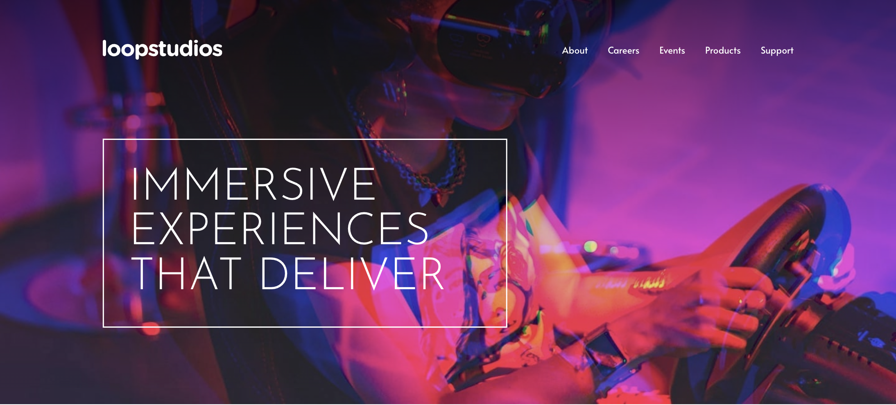
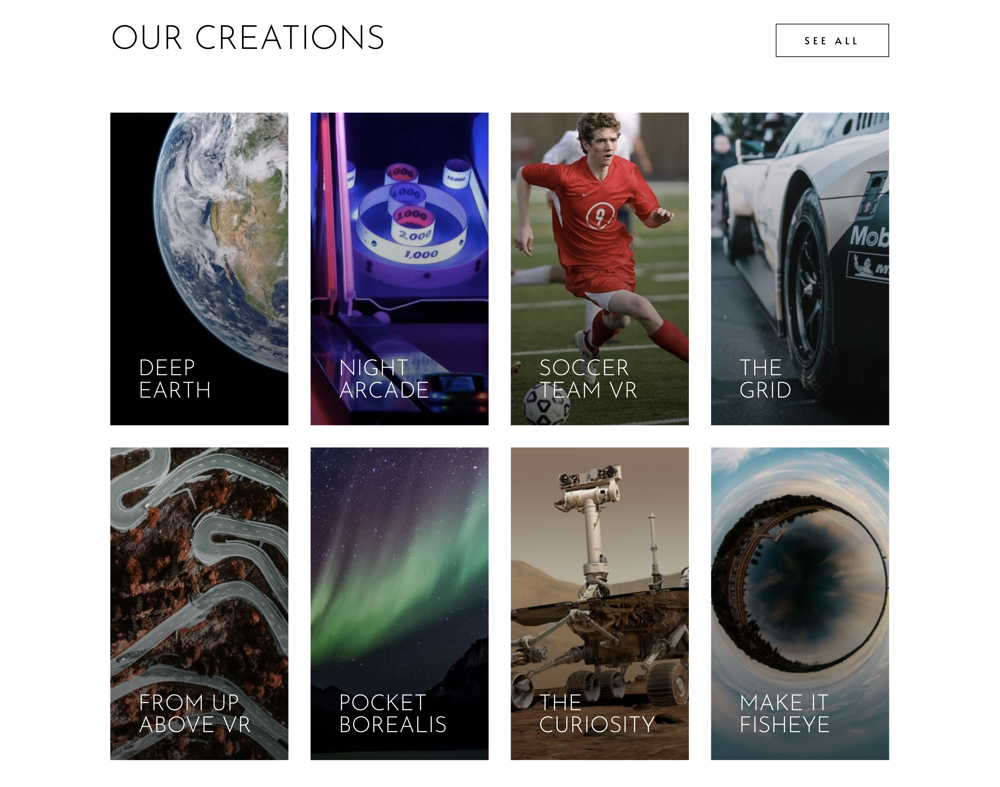

# Loopstudios Landing Page

## Table of contents

- [Overview](#overview)
  - [Screenshot](#screenshot)
  - [Links](#links)
- [My process](#my-process)
  - [Built with](#built-with)
- [Author](#author)

## Overview

### Screenshot

### Links

- Solution URL: [Solution URL](https://github.com/kisu-seo/loopstudios_landing_page)
- Live Site URL: [Live URL](https://kisu-seo.github.io/loopstudios_landing_page/)

## My process

### Built with

- **Semantic HTML5 Markup** — Structuring the page with `<header>`, `<nav>`, `<main>`, `<section>`, `<footer>` landmark elements so screen readers can navigate directly to each region. Each section is labeled via `aria-labelledby` pointing to its `<h2>`, creating a clear document outline without visual dependency.

- **CSS Custom Properties (Design Tokens)** — Centralizing all design values in `:root` as a single source of truth. Two categories coexist: base spacing tokens on an 8px-grid scale (`--spacing-100` → `--spacing-1000`) for universal use, and component-specific layout tokens (`--nav-mb-mobile: 163px`, `--interactive-image-width: 731px`) derived pixel-perfectly from the design spec to isolate magic numbers.

- **BEM Methodology** — Applying the Block-Element-Modifier naming convention throughout (e.g., `.creations__card`, `.creations__card-image`, `.btn--outline`, `.mobile-menu__link`) to make component boundaries immediately readable and to prevent unintended style leakage across sections.

- **CSS Flexbox** — Used for one-dimensional alignment: the `<nav>` bar (`space-between` for logo/hamburger), the mobile menu link stack (`flex-direction: column`), and the footer's two-column horizontal split at 768px+ (`flex-direction: row`).

- **CSS Grid** — Applied to `.creations__grid` for the gallery section. Starts as a single-column list on mobile (`grid-template-columns: 1fr`), then switches to a four-column, two-row layout on desktop (`repeat(4, 1fr)`) — the most significant structural change in the responsive breakpoint cascade.

- **Mobile-First Responsive Design** — Base styles target mobile (375px). Two `@media (min-width: …)` breakpoints progressively override layout: at **768px** the desktop hero image loads, the footer shifts to horizontal, and the interactive section gains an overlapping text panel via negative margin; at **1024px** the hamburger menu is replaced by inline nav links, and the gallery switches from 1-column to 4-column Grid with 120px-tall cards becoming 450px-tall portrait cards.

- **Art Direction with `<picture>`** — Each `<picture>` element serves a fundamentally different composition per viewport, not just a different file size. The interactive section switches source at `(min-width: 768px)` (landscape → portrait crop), and gallery cards switch at `(min-width: 1024px)` (mobile portrait → desktop portrait from a different angle), preventing the browser from downloading oversized images on narrow screens.

- **CSS-driven Slide Animation** — The mobile menu is permanently rendered in the DOM but parked off-screen via `transform: translateX(100%)`. JavaScript's only job is to add/remove the `.is-open` class; all motion is handled by `transition: transform 0.4s cubic-bezier(0.4, 0, 0.2, 1)` in CSS, keeping animation logic cleanly separated from behavioral logic.

- **Google Fonts (Josefin Sans + Alata)** — Two complementary typefaces loaded from Google Fonts with `<link rel="preconnect">` to minimize connection latency. Josefin Sans Light (300) is used exclusively for all uppercase headings (Presets 1–5); Alata Regular (400) handles body copy and navigation labels (Presets 6–7).

- **Vanilla JavaScript — Menu Toggle & Keyboard Accessibility** — A minimal script (`script.js`) manages three concerns: (1) `openMenu()` / `closeMenu()` functions toggle `.is-open` and `body.menu-open`, synchronize `aria-hidden` and `aria-expanded`, and programmatically move focus — `closeBtn.focus()` on open, `hamburgerBtn.focus()` on close — to maintain keyboard focus order. (2) A `forEach` loop attaches `closeMenu` to each nav link so clicking a link also dismisses the menu. (3) A `document` keydown listener closes the menu on `Escape`, guarded by `classList.contains('is-open')` to prevent focus disruption when the menu is already closed.

- **Hover State Design** — Every interactive element has a distinct hover treatment implemented via CSS pseudo-elements and transitions: nav/footer links use a center-expanding `::after` underline (`width: 0` → `width: 50%/100%`), gallery cards combine `transform: scale(1.05)` + `filter: brightness(0.4)` on the image with a white overlay and text color inversion, and the outline button inverts its background/color pair — all with consistent `0.3–0.4s ease` timing.

- **Web Accessibility (WCAG)** — Decorative images (`icon-hamburger.svg`, social icons) carry `alt=""` and `aria-hidden="true"` to suppress duplicate announcements. The mobile menu uses `role="dialog" aria-modal="true"` with `aria-hidden` toggled by JavaScript to correctly expose or hide the panel from the accessibility tree. `aria-label` is provided on every icon-only link and the hamburger button, and `:focus-visible` outlines are preserved for keyboard users.

## Author

- Website - [Kisu Seo](https://github.com/kisu-seo)
- Frontend Mentor - [@kisu-seo](https://www.frontendmentor.io/profile/kisu-seo)
